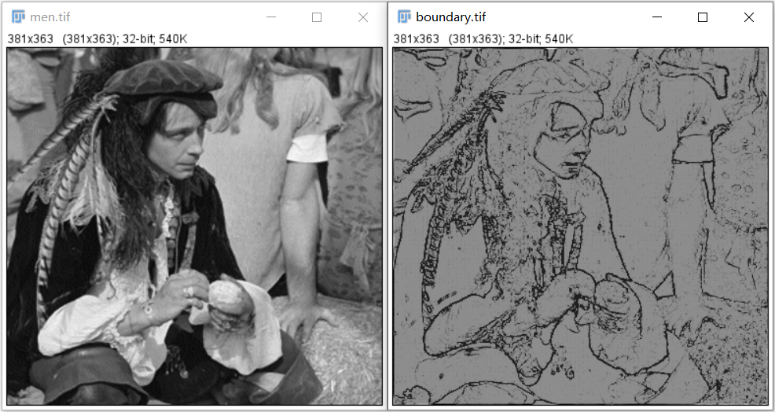
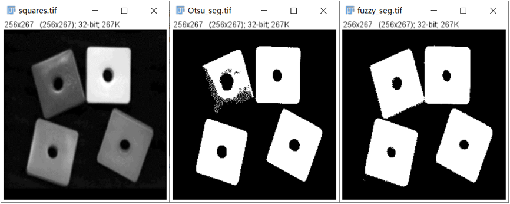
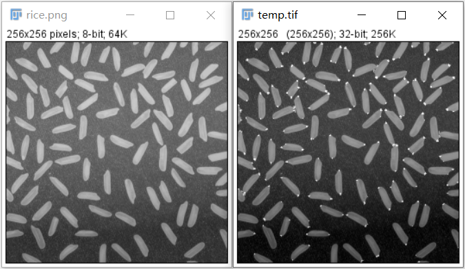

# 图像分析与理解实验

# Image Analysis and Understanding Experiments

### 1. 数学形态学 Mathematical Morphology 

> - **Python** implements the basic operations of morphology.
>
> - Use **numba** for CUDA acceleration.

##### 1. 二值图像 In binary image:

- 形态学重建 Morphology reconstruction （图略）
- 寻找凸包 Convex Hull

##### 2. 灰度图像 In gray image:

- 高帽变换 Top-hat transform （不均匀背景下的阈值分割）

- 形态学重建 H-dome （图略）

### 2. 模糊方法 Fuzzy Methods 

> - **Python** implements the basic operations of fuzzy methods.
> 
> - Use **numba** for CUDA acceleration.

##### 1. 模糊边界提取 Boundary extraction

##### 2. 模糊阈值分割 Threshold segmentation

- 附赠大津阈值分割 Otsu

### 3. Harris 角点检测 Harris Corner Detection

> cv2.filter2D

### 4. 透射变换 Perspective Transform

- 透射变换 + 图像融合

